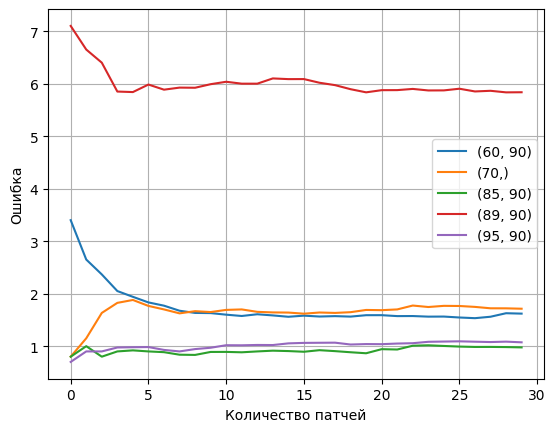

# Машинное обучение для задач информационной безопасности. Лабораторная работа №3

## Выполнили студенты: Мухин Артем 6233 и Килбас Игорь 6231

## Результаты выполнения работы

### Результаты для количества патчей = 1
| initial_qf   |   error |
|:-------------|--------:|
| (60, 90)     |     3.1 |
| (70,)        |     2.2 |
| (85, 90)     |     1.4 |
| (89, 90)     |     5.7 |
| (95, 90)     |     1.3 |

### Результаты для количества патчей = 30
| test_case   |    error |
|:------------|---------:|
| (60, 90)    | 1.62     |
| (70,)       | 1.71333  |
| (85, 90)    | 0.976667 |
| (89, 90)    | 5.83667  |
| (95, 90)    | 1.07333  |

Результаты усреднялись по 10 картинкам взятых из набора данных RAISE1k.

### График зависимости ошибки от количества патчей используемых для усреднения



## Инструкция для запуска

### Запуск в Google Colaboratory

Перед запуском необходимо выполнить следующие команды 
```
!sudo apt-get install libmagickwand-dev
!pip install --no-cache-dir \
    opencv-python-headless==4.6.*\
    rawpy==0.17.* \
    pandas \
    Pillow==7.1.2 \
    scikit-image==0.16.2 \
    scipy==1.4.1 \
    tqdm \
    Wand
```

### Локальный запуске через Docker

Рекоммендуется запускать через WSL либо на Unix системах.

Команда для сборки образа:
```bash
docker build -f Dockerfile.cpu -t ml-for-sec-3 .
```

Поднять контейнер можно следующей командой:
```bash
docker run --rm -it -v $(pwd):/workspace -u $(id -u):$(id -g) ml-for-sec-3
```
